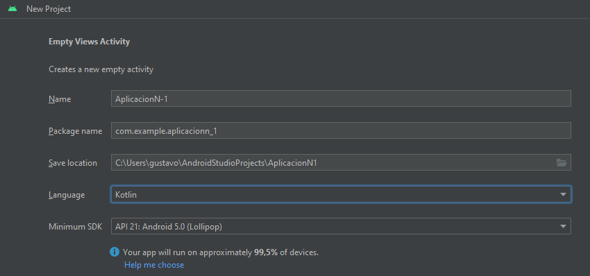
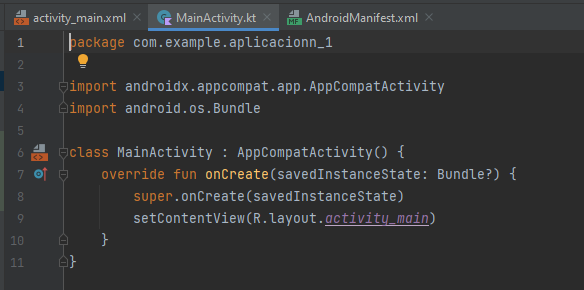
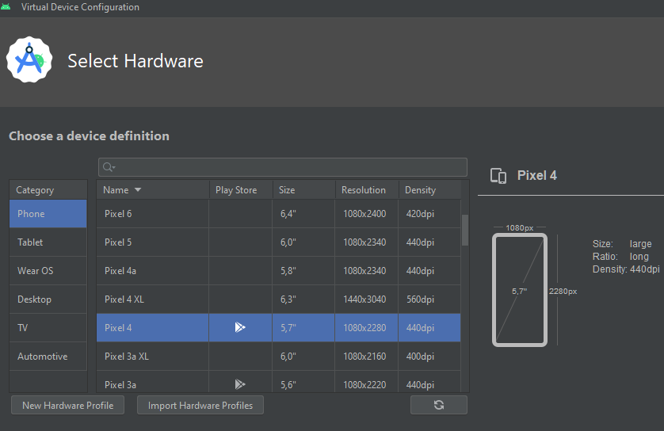
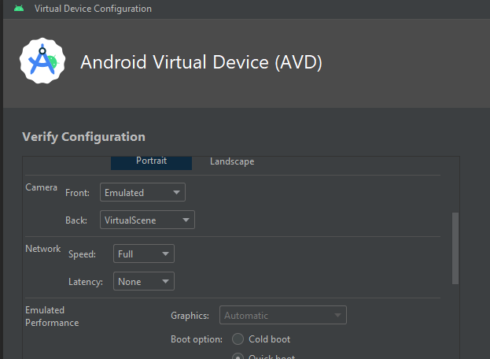
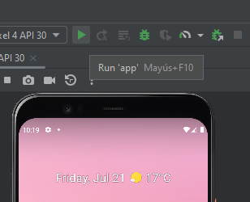

# Android

## Introducción a Android Studio

### Para iniciar

* nuevo proyecto en android studio
* elijo una plantilla
* 
* elijo nombre
* el package lo hace automático
* elijo carpeta
* language del curso va ser Kotlin
* el profe recomienda android 5 (a más viejo más dispositivos lo soportan, pero tiene menos funcionalidades)

El ide es parecido a PyCharm

Una vez inicializado vemos 3 partes muy importantes en la arquitectura: manifiesto, java y recursos.

#### Manifiesto

* Le va a decir al SO los requerimientos y de que trata la App

#### Java

* aunque desarrollamos en Kotlin la carpeta se llama Java, ahí va el código fuente.
* Tiene 3 paquetes: el del código, el de test android y de pruebas unitarias.
* A su vez el paquete ppal. tiene 3 clases, la principal es `mainActivity.ky`
* 
* hereda de `AppCompatActivity` e importa dependencias
* SINTAXIS: `override` es porque sobre escribo la clase padre, `fun` defino una función, `onCreate` nombre de la function

#### Recursos

* Básicamente los recursos gráficos, interfaz colores iconos etc

`Min 14 creamos emulador`
En device manager elijo crear dispositivo

* 

* En este caso descargo api 30 que es un android 12. **¡PESA mas de un giga OJO con las descargas!**

en network puedo elegir la velocidad y la latencia, velocidad de distintas redes y latencia el tiempo que tardan los datos en
ser leídos por el servidor

En parámetros configuro todo, señal, batería, cámara , micro huella etcetera.

*  con run corro la app sin poder detenerla con debug si puedo hacer modificaciones.

### Corro la app con debug

Luego de iniciar en la solapa de debug tengo los controles, (había puesto un breakpoint para que se detenga al iniciar)

<https://developer.android.com/codelabs/basic-android-kotlin-compose-intro-debugger?hl=es-419#4>

<https://developer.android.com/studio/debug?hl=es-419> "oficial"

.
